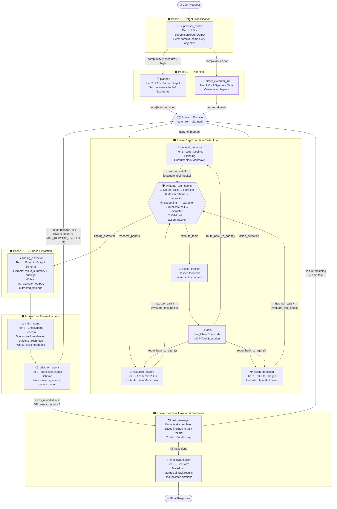

# Cognitive Agent Engine — Current Graph Architecture

> **Version:** Post-Refactor (2-Phase Pipeline)
> **Providers:** OpenAI · Anthropic (Claude)
> **Orchestration:** LangGraph `StateGraph`

---

## 1. Core Design Principles

The system operates as a **directed acyclic graph** (with intentional cycles for tool loops and rework loops). Three key architectural decisions shape the entire design:

1. **2-Phase Content/Extraction Separation** — Executor nodes output free-form Markdown. A dedicated `finding_extractor` node applies a structured LLM call downstream to safely parse findings into typed Pydantic schemas.
2. **Complexity-Aware Routing** — Simple requests bypass the Planner entirely (cost savings). Complex, multi-step requests are decomposed into a sequential task queue.
3. **Programmatic Safeguards** — Every potential infinite loop in the graph is bounded by hard constants enforced in the conditional edge functions, not in the LLM prompts.

---

## 2. AgentState — Shared Memory

All nodes communicate exclusively through `AgentState`, a `TypedDict` that LangGraph hydrates and persists across the graph.

| Field | Type | Set By | Read By |
|---|---|---|---|
| `messages` | `Sequence[BaseMessage]` | All nodes | All nodes |
| `user_id` / `session_id` | `str` | API entry | Executor nodes |
| `current_domain` | `str` | `supervisor_router` | Routers, Executors |
| `complexity` | `str` | `supervisor_router` | `route_from_supervisor` |
| `required_agents` | `List[str]` | `supervisor_router` | `planner` |
| `objective` | `str` | `supervisor_router` | `planner`, `critic_agent` |
| `tasks` | `List[Dict]` | `planner` / `direct_executor_init` | `task_manager`, Executors |
| `current_task_id` | `int` | `planner` / `task_manager` | `task_manager`, Executors |
| `iteration_count` | `int` | `planner` → Executors | `evaluate_tool_hooks` |
| `tool_call_count` | `int` | `action_tracker` | `evaluate_tool_hooks` |
| `action_history` | `List[str]` | `action_tracker` | `evaluate_tool_hooks` |
| `rework_count` | `int` | `reflection_agent` | `route_from_reflection` |
| `critic_feedback` | `str` | `critic_agent` | `reflection_agent` |
| `needs_rework` | `bool` | `reflection_agent` | `route_from_reflection` |
| `raw_executor_output` | `str` | `finding_extractor` | `critic_agent`, `task_manager` |
| `extracted_findings` | `List[Dict]` | `finding_extractor` | `critic_agent`, `task_manager` |

---

## 3. Node Reference

### Phase 0 — Entry & Intent Classification

#### `supervisor_router`
- **LLM Tier:** Tier 1 (fast)
- **Output Schema:** `SupervisorRouterOutput` (Pydantic, structured output)
- **Writes to State:** `current_domain`, `complexity`, `required_agents`, `objective`
- **Description:** The graph entry point. Reads the latest user message and outputs a structured routing decision. Assigns the correct domain (`general_memory`, `research_papers`, or `vision_detection`) with strict semantic rules to prevent hallucinated routing (e.g., preventing "forecast research" from being sent to `research_papers`).

---

### Phase 1 — Planning

#### `planner`
- **LLM Tier:** Tier 2 (balanced)
- **Output Schema:** `PlannerOutput` → `List[TaskItem]` (Pydantic)
- **Activated When:** `complexity` is `'medium'` or `'high'`
- **Writes to State:** `tasks`, `current_task_id`, `iteration_count` = 0, `rework_count` = 0
- **Description:** Acts as a project manager. Decomposes the user's objective into 2–4 sequential `TaskItem` sub-tasks, each with its own description and `target_agent` assignment. Respects critical routing rules to avoid misassigning web searches to the academic lane.

#### `direct_executor_init`
- **LLM Tier:** None (pure logic node)
- **Activated When:** `complexity` is `'low'`
- **Writes to State:** `tasks` (1 synthetic task), `current_task_id` = 1, all counters reset
- **Description:** A cost-saving bypass. Skips the Planner entirely and wraps the user's raw prompt into a single task object. Reuses the same downstream domain routing logic as the Planner.

---

### Phase 2 — Execution (ReAct Loop)

All three executor nodes follow the same **Reason → Action → Observation → Evaluate** cycle, and all produce **free-form Markdown output**. They never request JSON formatting — that responsibility belongs entirely to `finding_extractor`.

#### `general_memory`
- **LLM Tier:** Tier 2 (balanced)
- **Domain:** General-purpose — web searches, itineraries, coding, weather, standard Q&A
- **Tools:** Full MCP tool suite bound via `get_cached_bound_llm()`
- **RAG Context:** Retrieved from `general_memory` Qdrant collection via `HybridRetriever`

#### `research_papers`
- **LLM Tier:** Tier 3 (high-reasoning)
- **Domain:** STRICTLY academic literature, scientific PDFs, complex analysis
- **Tools:** Full MCP tool suite
- **RAG Context:** Retrieved from `research_papers` Qdrant collection using a query-transformed, optimized search query
- **Special Logic:** Applies "Critic Before Tool" heuristic in system prompt — the LLM must internally justify why a tool is needed before calling it.

#### `vision_detection`
- **LLM Tier:** Tier 1 (fast)
- **Domain:** STRICTLY image processing, YOLO models, bounding box configurations
- **Tools:** Vision-specific MCP tools
- **RAG Context:** Retrieved from `vision_detection` Qdrant collection

---

### Phase 2 — Tool Execution Infrastructure

#### `action_tracker`
- **LLM Tier:** None (pure logic node)
- **Description:** An interceptor that sits between the Executor and the actual tool node. Before any tool runs, it hashes the `(tool_name, args)` pair and appends it to `action_history`, and increments `tool_call_count`. This is what enables the duplicate detection and budget limit safeguards in `evaluate_tool_hooks`.

#### `tools` *(LangChain ToolNode)*
- **Description:** The standard LangChain `ToolNode` wrapping all registered MCP tools. Executes the tool call and appends a `ToolMessage` to the message stream. Tool output is routed back to the issuing Executor domain via `route_back_to_agent`.

---

### Phase 3 — 2-Phase Information Extraction

#### `finding_extractor` *(New node — core of the 2-Phase design)*
- **LLM Tier:** Tier 1 (fast)
- **Output Schema:** `ExecutorOutput` → `result_summary` + `List[Finding]` (Pydantic)
- **Writes to State:** `raw_executor_output`, `extracted_findings`
- **Description:** Receives the executor's raw Markdown, then applies a short, tightly-scoped structured-output LLM call to extract structured findings. **This is the only place where JSON is produced from executor content.** By isolating JSON extraction here (with a focused prompt), the risk of `JSONDecodeError` from code snippets or Markdown headers embedded in executor responses is eliminated entirely.

---

### Phase 4 — Evaluation & Rework

#### `critic_agent`
- **LLM Tier:** Tier 2 (balanced)
- **Output Schema:** `CriticOutput` (Pydantic)
- **Reads from State:** `raw_executor_output`, `extracted_findings`, `objective`, `action_history`
- **Writes to State:** `critic_feedback`
- **Description:** Audits the extraction results against the master objective using 4 scored dimensions: `tool_quality_score`, `evidence_quality_score`, `citation_quality_score`, `freshness_score` (each 1–10). Exposes hallucinated parameters and missing sources in its feedback.

#### `reflection_agent`
- **LLM Tier:** Tier 2 (balanced)
- **Output Schema:** `ReflectionOutput` (Pydantic)
- **Reads from State:** `critic_feedback`, `raw_executor_output`, `rework_count`
- **Writes to State:** `needs_rework`, `reflection_notes`, `rework_count` (incremented if reworking)
- **Description:** Synthesizes critic feedback into a binary decision (`needs_rework`) and an actionable directive. When `needs_rework=True` and the rework counter is below `MAX_REWORK_CYCLES=2`, routes back to the active Executor domain. If the cap is reached, force-advances to `task_manager`.

---

### Phase 5 — Task Iteration & Final Output

#### `task_manager`
- **LLM Tier:** None (pure logic node)
- **Reads from State:** `raw_executor_output`, `extracted_findings`, `tasks`, `current_task_id`
- **Writes to State:** `tasks` (marks current as `completed`), advances `current_task_id`
- **Description:** The iteration controller. Saves `raw_executor_output` and `extracted_findings` directly into the current task's record (zero JSON parsing — data comes pre-structured from `finding_extractor`). If more tasks are pending, performs **Context Sandboxing** (removes all messages except the first user prompt) and queues the next task. If the queue is empty, routes to `final_synthesizer`.

#### `final_synthesizer`
- **LLM Tier:** Tier 2 (balanced)
- **Writes to State:** `messages` (final response)
- **Description:** Reads all completed task results and aggregated findings, then generates a single, polished, deduplicated Markdown response for the user. Also records the total `iteration_count` as a Prometheus metric.

---

## 4. Full Graph Diagram



---

## 5. Conditional Edge Router Reference

| Router Function | Source Node | Conditions | Targets |
|---|---|---|---|
| `route_from_supervisor` | `supervisor_router` | `complexity == 'low'` | `direct_executor_init` |
| | | `complexity != 'low'` | `planner` |
| `route_from_planner` | `planner`, `direct_executor_init` | `tasks[0].target_agent` | `general_memory` / `research_papers` / `vision_detection` |
| `evaluate_tool_hooks` | `general_memory`, `research_papers`, `vision_detection` | No tool calls | `finding_extractor` |
| | | `iteration_count >= 8` | `finding_extractor` (forced) |
| | | `tool_call_count >= 10` | `finding_extractor` (forced) |
| | | Duplicate action detected | `finding_extractor` (forced) |
| | | Valid tool call | `action_tracker` |
| `route_back_to_agent` | `tools` | `current_domain` value | `general_memory` / `research_papers` / `vision_detection` |
| `route_from_reflection` | `reflection_agent` | `needs_rework=True` AND `rework_count < 2` | Domain Executor (rework) |
| | | `needs_rework=False` OR `rework_count >= 2` | `task_manager` |
| `route_from_task_manager` | `task_manager` | `current_task_id is not None` | Domain Executor (next task) |
| | | `current_task_id is None` | `final_synthesizer` |

---

## 6. Programmatic Safeguards

All safeguards are enforced in `evaluate_tool_hooks` and `route_from_reflection` — outside of LLM prompts, making them reliable and deterministic.

| Safeguard | Constant | Enforced In | Action |
|---|---|---|---|
| Max Iterations | `MAX_ITERATIONS = 8` | `evaluate_tool_hooks` | Force-route to `finding_extractor` |
| Max Tool Calls (Budget) | `MAX_TOOL_CALLS = 10` | `evaluate_tool_hooks` | Force-route to `finding_extractor` |
| Duplicate Tool Detection | MD5 hash comparison | `evaluate_tool_hooks` | Block + force-route to `finding_extractor` |
| Max Rework Cycles | `MAX_REWORK_CYCLES = 2` | `route_from_reflection` | Skip rework, force-advance to `task_manager` |

---

## 7. LLM Tier Assignment

| Tier | Usage | OpenAI Model | Claude Model |
|---|---|---|---|
| Tier 1 (Fast) | `supervisor_router`, `finding_extractor`, `vision_detection` | `tier1_fast_model` | `tier1_fast_model` |
| Tier 2 (Balanced) | `planner`, `general_memory`, `critic_agent`, `reflection_agent`, `final_synthesizer` | `tier2_balanced_model` | `tier2_balanced_model` |
| Tier 3 (Reasoning) | `research_papers` | `tier3_reasoning_model` | `tier3_reasoning_model` |

> Tier assignments are resolved from `settings.py` — never hardcoded in node logic. Changing a model in `.env` automatically propagates to all nodes using that tier.

---

## 8. Infrastructure Components (Container)

The `Container` class bootstraps all shared infrastructure services on first request.

```
Container
├── redis_client          → Async Redis (session management)
├── embedding_provider    → OpenAIEmbeddings (text-embedding-3-small)
├── vector_store          → QdrantVectorStore
├── memory_store          → QdrantMemoryStore (long-term memory writes)
├── semantic_cache        → QdrantSemanticCache (versioned by LLM model tag)
├── memory_service        → MemoryService (CRUD over memory_store)
├── extractor             → FactExtractor (background fact mining, OpenAI or Claude)
├── memory_worker         → MemoryWorker (RabbitMQ consumer pipeline)
└── hybrid_search         → HybridRetriever (BM25 + dense vector retrieval)
```
